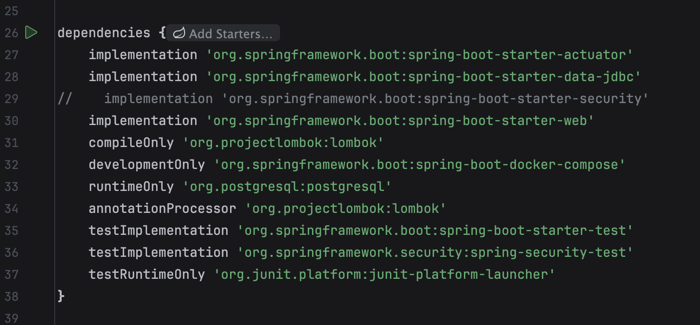
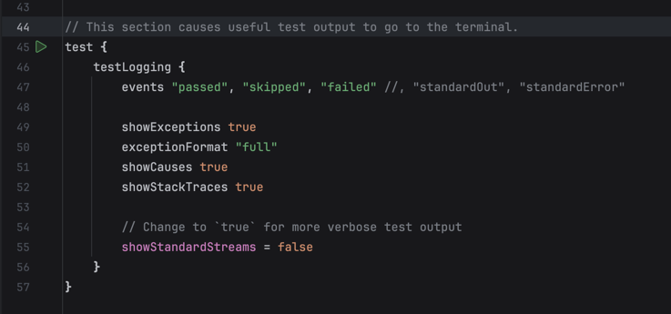
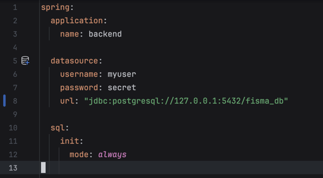

# ee73f2d (Spring initial setup)

documentti koskee committia: [ee73f2d](https://github.com/fisma-benefit-app/benefit-app/commit/ee73f2dcbe6835d609fbe895b23482090298a118)

### Dependencies

#### Actuator

- Actuator, jotta voi katsella mm. missä beanit menee.

#### JDBC

- Laitoin alustavast ja voidaan vaihtaa, jos halutaan. Tästä oli video Slacin backend kanavalla.

#### Security, Web, PostgreSQL

- Security kommentoitu vielä pois ja laitetaan päälle kun aika koittaa.

#### Lombok

- Vähentää boilerplatea ja tekee koodista helpompaa lukea.

#### Docker compose

- Automaattinen docker compose. Etsii compose-fileä defaulttina projektin rootista ja mielestäni root on selkeämpi paikka ylipäätään. Sijainti rootissa on mahdollisesti kätevämpi myös CI/CD. 

❗️Huom! Docker Desktopin pitää olla päällä muuten Spring ei lähde päälle ❗️

---

### Testaukseen parempi log

---

### application.yaml

Ilman datasourcea ei lähde päälle. Datasource määritetty dockerin Postgrehen. 